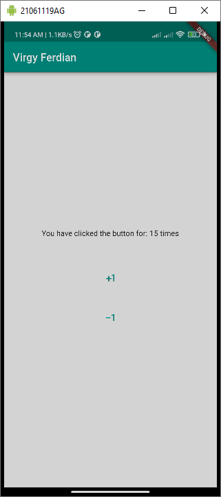

### Absensi Pertemuan 3

Membahas tentang layout pada flutter seperti container, scaffold, Row yang bersifat horizontal, serta Column yang bersifat vertical.  

Layout pada flutter bisa dibilang bersifat seperti petak-petak, jadi semisal kita meletakan 2 widget pada suatu Row maka kedua widget tersebut akan mengisi 2 petak bersandingan di dalam Row dari kiri ke kanan(karena Row bersifat horizontal).  

Contoh hasil percobaan:  

